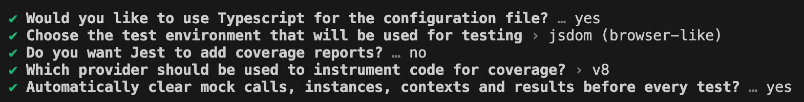

# Next.js 14 + TypeScript + Jest Setup

This guide walks you through setting up a Next.js 14 project with TypeScript and Jest for testing.

## Installation

### Step 1: Install Next.js 14

To create a new Next.js 14 project, use the following command:

```bash
npx create-next-app@14 next-jest-ts
cd next-jest-ts
yarn install
```

### Step 2: Install Jest

Add Jest and related libraries for TypeScript support:

```bash
yarn add -D jest ts-jest ts-node jest-environment-jsdom
```
(Optional): Add Testing Libraries
```bash
yarn add -D @testing-library/react @testing-library/jest-dom
```

### Step 3: Initialize Jest Configuration

Run the following command to initialize Jest configuration:

```bash
yarn create-jest
```


### Step 4: Configure ts-jest (or Babel as an alternative)

To enable TypeScript support in Jest, install `ts-jest`:

```bash
yarn add -D ts-jest
```

Then, update `jest.config.ts` to include the following preset:

```tsx
preset: 'ts-jest',
```

### Step 5: Install Jest Types

Install Jest type definitions:

```bash
yarn add -D @types/jest
```

## Writing Your First Test

Let's create a simple function and a test to validate its functionality.

1. Create a file, `addNumbers.tsx`, with the following content:
    
    ```tsx
    export function addNumbers(a: number, b: number): number {
        return a + b;
    }
    ```
    
2. Write a test in `addNumbers.test.tsx`:
    
    ```tsx
    import { addNumbers } from './addNumbers';
    
    describe('addNumbers', () => {
        it('should return 3 when adding 1 and 2', () => {
            expect(addNumbers(1, 2)).toBe(3);
        });
    });
    ```
    

## Running Tests

Run your tests with:

```bash
yarn test
```

This command will execute all tests in your project, ensuring your functions work as expected.